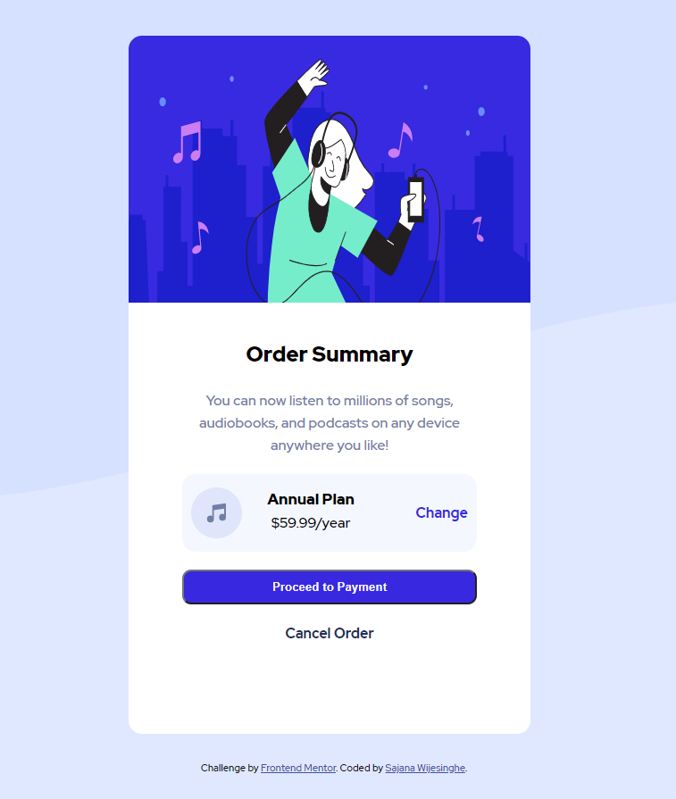
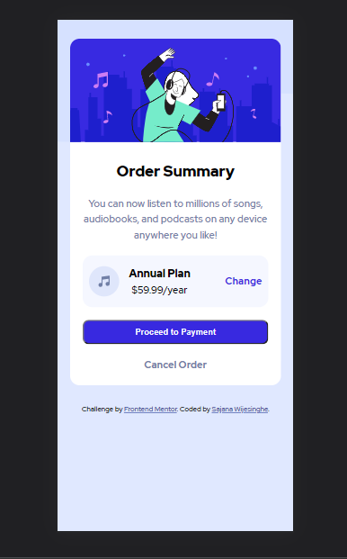

# Frontend Mentor - Order summary card solution

This is a solution to the [Order summary card challenge on Frontend Mentor](https://www.frontendmentor.io/challenges/order-summary-component-QlPmajDUj). Frontend Mentor challenges help you improve your coding skills by building realistic projects. 

## Table of contents

- [Overview](#overview)
  - [The challenge](#the-challenge)
  - [Screenshot](#screenshot)
  - [Links](#links)
- [Built with](#built-with)
- [Author](#author)

## Overview

### Screenshot

### Links

- Live Site URL: [https://stormking969.github.io/Frontend-Mentor---Order-Summary/](https://stormking969.github.io/Frontend-Mentor---Order-Summary/)

### Built with

- Semantic HTML5 markup
- CSS custom properties
- Flexbox
- Mobile-first workflow

## Author

- Website - [Sajana Wijesinghe](https://sajana-wijesinghe.com/)
- Frontend Mentor - [@StormKing969](https://www.frontendmentor.io/profile/StormKing969)
